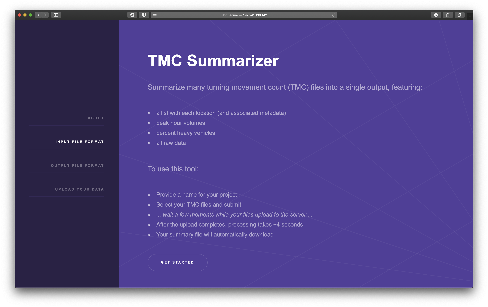

# tmc-app

``Flask`` front end for the [``tmc_summarizer``](https://github.com/dvrpc/tmc-summarizer)

## Live Demo

Here: [http://167.172.146.34](http://167.172.146.34)

## Deployment

This app is running on the cheapest DigitalOcean droplet available, at $5/month.

Server was set up following [https://www.digitalocean.com/community/tutorials/how-to-serve-flask-applications-with-uswgi-and-nginx-on-ubuntu-18-04](https://www.digitalocean.com/community/tutorials/how-to-serve-flask-applications-with-uswgi-and-nginx-on-ubuntu-18-04)